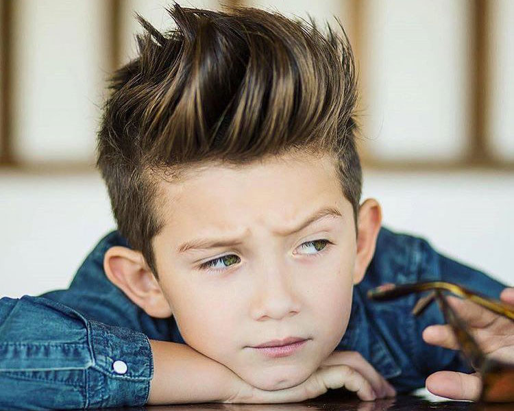

# u2net-keras
Simple scripts for testing U-2-Net models in Keras. <br/>
Based on https://github.com/NathanUA/U-2-Net and https://github.com/shreyas-bk/U-2-Net-Keras <br/>
Keras u2net, u2netp and u2net_portrait models were converted from the original pytorch models. <br/>

# Result
Background substraction model


Portrait creation model



# Quick start
1. Clone this repo to local
```
git clone https://github.com/NathanUA/U-2-Net.git
```
2. Get models from [**here**](https://drive.google.com/drive/folders/1oLFscPEoqxHIcRvNT80ps4XAH9ab5LH2)

3. Test u2net/u2netp (background substraction) models
```
python u2net-keras.py images/input.jpg images/output.png
```

4. Test u2net_portrait model
```
python u2net_portrait-keras.py images/input_portrait.jpg images/output_portrait.png
```

# Known issues
- Dont work with tensorflow without CUDA support. <br/>
